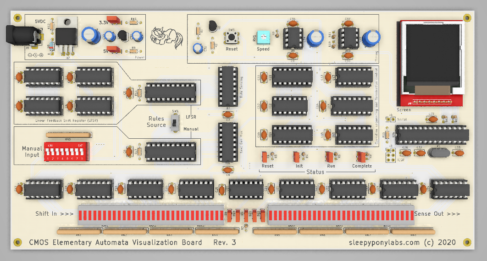

# CMOS Elementary Automata Visualization Board

This is an  open-source KiCad design files for a circuit that could generate and visualize [Elementary Automata](https://mathworld.wolfram.com/ElementaryCellularAutomaton.html) only by using common logic ICs. There are two versions available: Standard and Minimal. 
**Disclaimer: Only the Standard version had been tested with real hardware. The Minimal version should theoretically work and will be tested soon but right now there are no guaranteed whatsoever that it will work.**

## Standard Version

Standard version is a large board of size 247x127mm (9.7x5in), suitable for putting in a frame. Featuring:

 - 26 Logic ICs in DIP package. (Okay, I have an ATMEGA328 here but it's here just to drive the display. Its firmware is available here as well.)
 - 1.44 inch TFT display with a display driver which can draws a complete picture of that elementary automata rule.
 - Fully visualized 65-bit shift register so you can see how the data flows.
 - Fully selectable 8-bit automata rule input.
 - An LSFR pseudo-random rules generator.
 - Status display.
 - Drawing speed adjustment.
 - All through hole design. Should be relatively easy to solder.

We are currently at Revision 2. Changelog is below:
**Revision 2 (May 2020)**
 - Fixed Connector orientation for the display and the DIP switch.
 - Connected GND to mounting holes
 - Change of parts in the power section due to sourcing issue.
 
**Revision 1 (January 2020)**
- Initial Design

## Minimal Version

Minimal Version is a smaller board of size 129x72mm (5x3in). It is suitable for carrying around to show off. Featuring:

 - 23 Logic ICs in SOT, SOIC, TSSOP, and TQFP packages.
 - 1.44 inch TFT display.
 - Fully selectable 8-bit automata rule input.
 - An LSFR pseudo-random rules generator.
 - Status display.
 - Drawing speed adjustment.
 - Very challenging SMD soldering practice kit.
 - The PCB should be much cheaper to produce. It's still a little bit too large to fit in 10x10cm requirements for many cheap PCB fabs though, I might try to squeeze it down later.

We are currently at Revision 2. Changelog is below:
**Revision 2 (May 2020)**
 - Fixed all of the issues found in rev 1 of the Standard version.
 - Change of parts in the power section due to sourcing issue.
 
**Revision 1 (April 2020)**
- Initial Design (Based on Standard version)

## What is provided
The goal of this repository is to enable you to build this on your own as easy as possible (although I originally plan to sell this as a kit as well). **I've included all of the schematics, gerbers, BOMs, and display driver firmware for you to use.** And this work is licensed under a [Creative Commons Attribution-NonCommercial 4.0 International License](http://creativecommons.org/licenses/by-nc/4.0/).

Unfortunately. I have to excluded the 3D models use to render the board in KiCAD because I don't know how each of them was licensed. They are all from GrabCad and you could search and download them by yourself.

**Note: Due to this, there might be a popup warning you about "3D model Search Path" in PCBNew. I honestly don't know how to fix this but it will not affect any KiCAD functionality.**